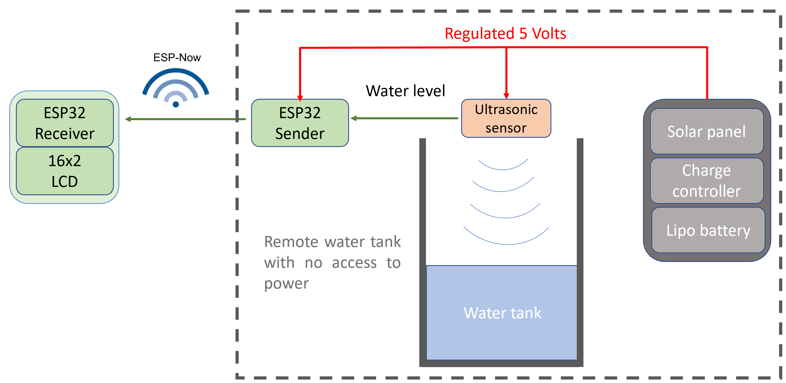

# **WaterSensor project**
 Wireless sensor for monitoring the level of a remote water tank.

 The motivation for this small home project came from the need to monitor the water level of a water tank used for watering. When the tank empties it causes air to fill the pipes and hoses, making it a bit of a pain to get out. With this system its easier to know when the tank is about to empty and flip a switch to turn on a water pump (in the future this system will automatically control the pump).

 ## **System overview**

 

In simple terms, the water level is read by a HC-SR04 ultrasonic sensor which works well on water and doesn't corrode like those contact sensors you dip into water. The sensor data is acquired by a ESP32 and sent to a second ESP32 in another location using ESP-NOW which works well over longer distances and has smaller overhead than WIFI. The water level is then displayed on a standard 16x02 LCD.

One of the challenges of the system came from the fact that the water tank is in a place with no power, so a solar panel made sense to power the sensor and microcontroller. A charge controller and a Lipo battery work together with the solar panel to regulate power to a stable 5V and provide power in periods of no sun. The ESP32 sender board was custom designed to have minimal components to save battery.

## **Materials/tools used**

- 5W Solar panel and solar power management module bought from [Waveshare](https://www.waveshare.com/solar-power-manager.htm).
- 1800 mAh Lipo battery.
- Custom designed ESP32 board.
- HC-SR04 Ultrasonic sensor.
- A second generic ESP32 board + 16x02 LCD.
- Creality Ender 3v2 for printing the enclosures for the PCB, sensor and power module to protect from dust.

## **Repository contents**

| Folder/Files           | Description                                                                          |
| ---------------------- | ------------------------------------------------------------------------------------ |
| [pcb](/pcb)            | Details and CAD files of the custom ESP32 board made for this project                |
| [firmware](/firmware)  | Firmware of both the receiver and sender ESP32 boards                                |
| [models](/models)      | STL files of the 3D printed parts for the enclosures                                 |

## **Pictures**

