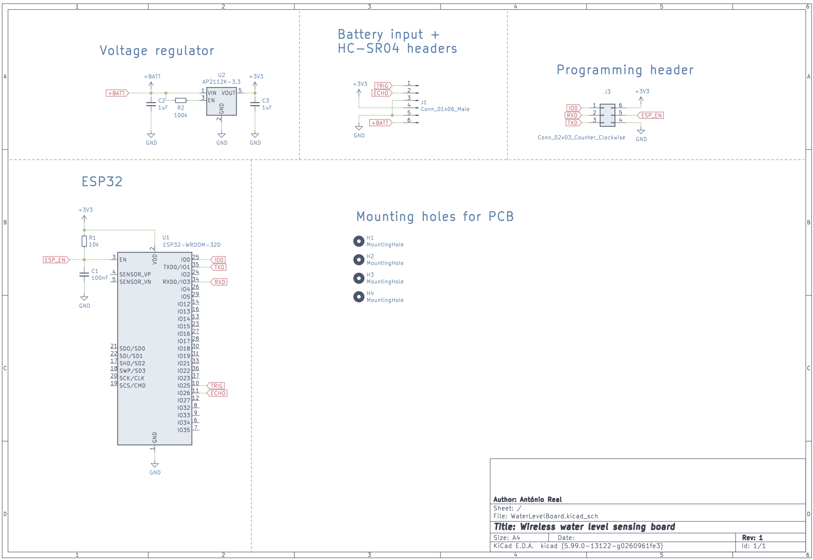

# **Wireless sensor board**

This PCB design was kept to a minimum in order to optimize power consumption since it will function on a lipo battery. The main features:

- AP2112 3.3V low dropout (~50mV drop at 100mA) regulator to step down from the 5V that comes from the battery circuit.
- ESP32 microcontroller responsible for reading the HC-SR04 sensor and sending it through ESP-NOW protocol to a second ESP32.
- Screw terminals to easily connect the battery and the HC-SR04 ultrasonic sensor.

The PCB was designed using **Kicad 5.99** nightly build (soon to be released as Kicad 6).

   

## **Schematic**

## **3D render of the PCB**

## **Manufactured PCB**
The PCB was manufactured in a PCB milling machine and unfortunately came out poorly and required some enameled wire to replace the tracks.
